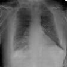

Auxiliary Classifier GAN for Covid & healthy X-rays image generation implementation in Tensorflow.
This is a non-official implementation of the CovidGAN 
architecture described in the paper CovidGAN: Data Augmentation Using Auxiliary Classifier GAN for Improved Covid-19 Detection (https://arxiv.org/abs/2103.05094).


# Abstract
--------------------------------

One of the biggest challenges in the medical field is the limitations of the data quantity, especially for training classifiers based on neural networks. The objective of this 
project is to develop a GAN (AC-GAN) to generate both Covid and healthy X-ray images. The GAN is used to generate a dataset that will be used to train a classifier.

## Common questions
- **Why not using data augmentations based on image manipulations (geometric/photometric)?** This type of transformations cannot be done without clinical considerations otherwise it will perform poorly on validation.
- **Why using an AC-GAN?** We have also tested a DC-GAN and compared the results. However, the AC-GAN allows to generate X-rays of multiple classes (covid, pneumonia ...)


# Training
---------------------------------
Training the GAN is done by executing:

```
$ python src/models/train.py -d [path-to-data] -z [latent-dimension] -s [save-model-every]
```
The training will save the models every -s epoch into saved_models/ folder and the generated training images in saved_images/ folder.


# Generate dataset:
------------------------
Generating dataset is done by executing:
```
$ python src/models/generate.py -m [path-to-model] -c [Nb covid images] -n [Nb non-covid images]
```
The generated images will be saved in CovidCXR/ and NonCovidCXR/

# Evaluation FID score:
----------------------------
The frechet-inception distance is a metric for quantifying the distance between two distributions of images. A small FID means that the two datasets come from nearly similar distributions.
Computing the FID is done by executing:
```
$ python src/evaluation/eval_fid.py -r [path-to-real-dataset] -g [path-to-generated-dataset] -b [batch-size]
```

# Sample of generated data:
<p align="center">
  
</p>
